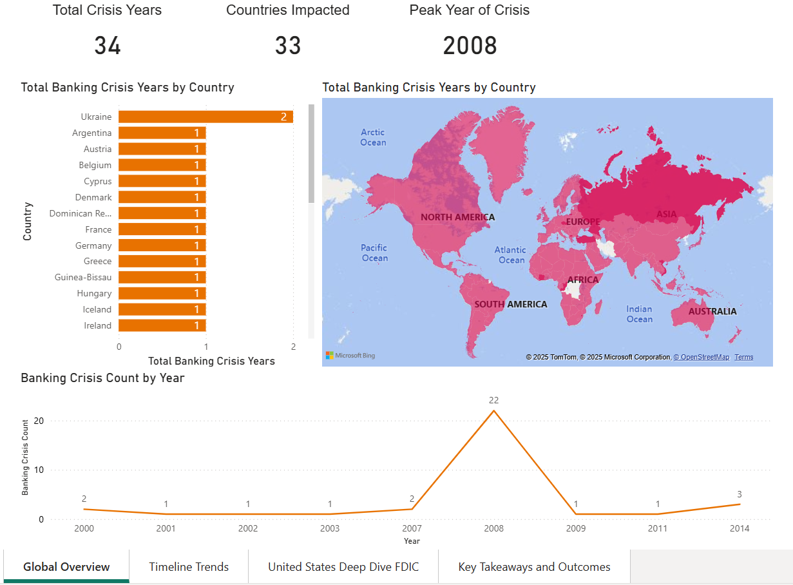
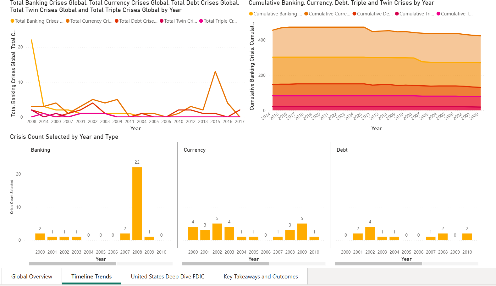

# 🏦 When Banks Fail: A Global Crisis Atlas

**572 U.S. bank failures. 151 crisis years across 118 countries. One dashboard to understand them all.**

We asked a simple question: *Do financial crises follow patterns, or are they random shocks?*

This project merges four major datasets spanning 1970–2024 to map the anatomy of banking crises—when they strike, where they cluster, and what precedes them.

---

## The Story in Three Acts

### 1. **Crises Don't Happen Alone**
Banking, currency, and debt crises overlap. When one falls, others follow. The 2008 global financial crisis wasn't an outlier—it was a convergence of all three crisis types hitting 22 countries simultaneously.

### 2. **Geography Matters**
U.S. bank failures spiked to 157 in 2010, concentrated in Georgia, Florida, and Illinois. Emerging markets face persistent currency and banking shocks. Developed economies aren't immune—they just fail differently.

### 3. **The Patterns Are Predictable**
Rapid credit growth, deteriorating bank balance sheets, and macroeconomic stress signals appear before crises hit. They're not black swans—they're red flags.

---

## What's Inside

**Global Overview** → 34 total crisis years, 33 countries impacted, peak chaos in 2008  
**Timeline Trends** → Crisis clustering across banking, currency, and debt types  
**U.S. Deep Dive** → 572 FDIC failures mapped by state and year  
**Key Insights** → Cumulative crisis patterns and systemic vulnerabilities

---

## The Data

We combined four authoritative sources:

- **FDIC Failed Bank List** (2000–2024) — Every U.S. bank closure, with location and assets
- **IMF Systemic Banking Crises Database** (2018) — Global records of systemic events
- **World Bank Global Financial Development** — Credit growth, NPLs, capital ratios
- **World Development Indicators** — GDP, inflation, unemployment, interest rates

Cleaned. Standardized. Unified across 118 countries and 50+ years.

---

## Previews

### 🇺🇸 **The 2008-2010 U.S. Banking Collapse**

### 🌍 **Global Crisis Patterns Across Time**

### 🗺️ **Where Crises Strike**

---

## What We Learned

Financial crises aren't mysteries. They're the result of measurable, trackable vulnerabilities. This dashboard shows:

- **Systemic risk is contagious** — Crises cluster in time and space
- **Emerging markets stay fragile** — Currency and banking shocks repeat
- **Warning signs exist** — Credit booms and macro stress precede collapses

The goal isn't prediction. It's preparation.

---

## Explore the Dashboard

Download `Financial_Crisis_Dashboard.pbix` and open it in [Microsoft Power BI Desktop](https://powerbi.microsoft.com/desktop/) to interact with the full analysis.

**Data Coverage**: 1970–2024 | 118 Countries | 4 Integrated Datasets

---

**Built by**: Amrutesh, Chirasmayee, Devaang, Vatsal, Gaurav
**Why**: Because understanding the past is how we avoid repeating it.
